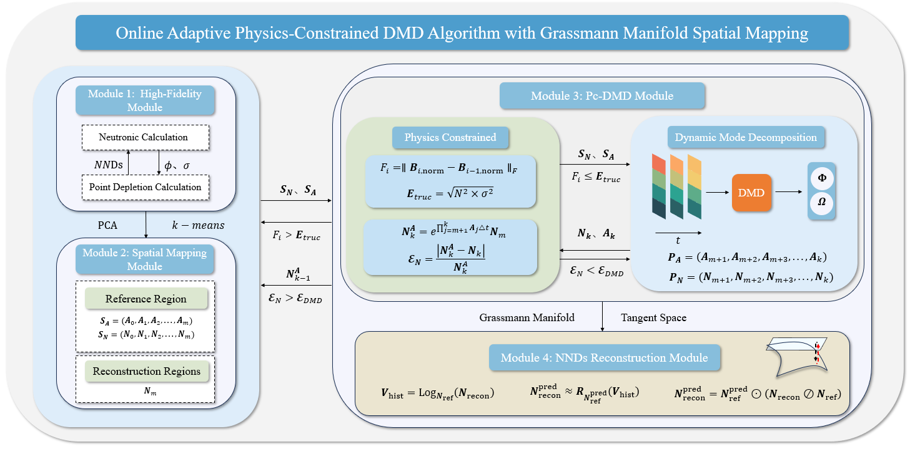

# An-Online-Adaptive-Pc-DMD-Algorithm-with-Grassmann-Manifold-Spatial-Mapping

This repository is the official placeholder for the code associated with the paper: 
**"An online adaptive physics-constrained DMD algorithm with Grassmann manifold spatial mapping for neutronic-depletion coupling calculation"**, published in *Computer Physics Communications* (CPC). (https://doi.org/10.1016/j.cpc.2026.110204)

## Notice on Code Availability

Due to **intellectual property protection (IP)**, pending patent applications, and the proprietary nature of the core algorithms developed by our research group, the full source code has been moved to a private internal repository.

## ⚙️ Algorithm Framework (算法框架)

The overall computational workflow of the proposed online adaptive physics-constrained DMD algorithm is illustrated below. It consists of four tightly coupled modules: the High-Fidelity Module, the Spatial Mapping Module, the Pc-DMD Module, and the NNDs Reconstruction Module.

*(The framework seamlessly integrates high-fidelity neutronic calculations with data-driven DMD and Grassmann manifold mapping to achieve rapid and accurate neutronic-depletion coupling.)*

## How to Access 

We remain committed to scientific reproducibility. If you are a researcher wishing to:
1. Verify the results presented in the paper.
2. Collaborate on further developments.
3. Request a compiled "black-box" version (executable) for testing.

Please contact the author via email: **ghysz@foxmail.com**

Requests should include your name, affiliation, and a brief statement of your research purpose. We may provide specific modules or compiled binaries under a Non-Disclosure Agreement (NDA).

---
© 2026 GongHanyuan. All rights reserved.
